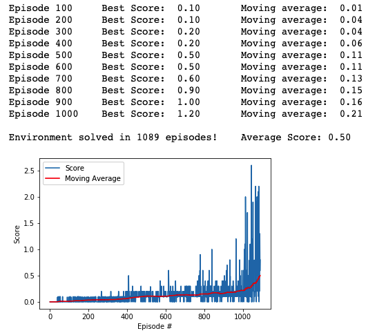

# Report of Udacity Deep Reinforcement Learning Nanodegree Project 2: Continuous Control with DDPG algorithm

This is my report for the second project of the Udacity Deep Reinforcement Learning Nanodegree, Continuous control with ddpg algorithm


<p align="center">  </p> 


## Learning algorithm 

### MADDPG Algorithm

MADDPG, or Multi-agent DDPG, extends DDPG into a multi-agent policy gradient algorithm where decentralized agents learn a centralized critic based on the observations and actions of all agents. It leads to learned policies that only use local information (i.e. their own observations) at execution time, does not assume a differentiable model of the environment dynamics or any particular structure on the communication method between agents, and is applicable not only to cooperative interaction but to competitive or mixed interaction involving both physical and communicative behavior. The critic is augmented with extra information about the policies of other agents, while the actor only has access to local information. After training is completed, only the local actors are used at execution phase, acting in a decentralized manner.


## Code implementation

The codes consist of 3 files:

- `model.py` : Implement the **Actor** and the **Critic** class.
    
- `maddpg_agent.py` : Implement the MADDPG agent
    
- `Tennis.ipynb` : In this Jupyter Notebook file, we can train the agents. 
 
## Hyperparameters

The DDPG agent uses the following hyperparameters:

```

BUFFER_SIZE = int(1e6)  # replay buffer size
BATCH_SIZE = 256        # minibatch size
GAMMA = 0.99            # discount factor
TAU = 1e-2              # for soft update of target parameters
LR_ACTOR = 1e-4         # learning rate of the actor
LR_CRITIC = 1e-3        # learning rate of the critic
WEIGHT_DECAY = 0        # L2 weight decay

n_episodes=2000         # maximum number of episodes to train
```

Both Actor and Critic contain 3 hidden layers with Batch Normalization and ReLU activation functions , fc1_units=400, fc2_unit=300. At the end of Actor, there is an extra tanh activation function to guarantee that the range of actions is (-1, 1).


## Results

<p align="center">  </p> 


The result satisfies the goal of this project as the average (over 100 episodes) of those average scores is at least +30 after 467 episodes

## Ideas for future work

- tune again hyperparameters for better results
- use prioritized replay to increment performances
- try other algorithms
-use prioritised experience buffer
