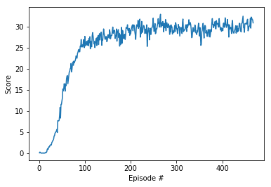
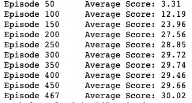

# Report of Udacity Deep Reinforcement Learning Nanodegree Project 2: Continuous Control with DDPG algorithm

This is my report for the second project of the Udacity Deep Reinforcement Learning Nanodegree, Continuous control with ddpg algorithm


In this environment, a double-jointed arm can move to target locations. A reward of +0.1 is provided for each step that the agent's hand is in the goal location. Thus, the goal of your agent is to maintain its position at the target location for as many time steps as possible.

The observation space consists of 33 variables corresponding to position, rotation, velocity, and angular velocities of the arm. Each action is a vector with four numbers, corresponding to torque applicable to two joints. Every entry in the action vector should be a number between -1 and 1.

<p align="center">  </p> 


## Environment description

For this project, you will work with the Reacher environment. The goal is to to take into account the presence of many agents, 20 for this environment. In particular, your agents must get an average score of +30 (over 100 consecutive episodes, and over all agents). 

After each episode, we add up the rewards that each agent received (without discounting), to get a score for each agent. This yields 20 (potentially different) scores. We then take the average of these 20 scores.

## Learning algorithm 

### DDPG Algorithm
The agent in this environment is trained with DDPG algorithm (Deep Deterministic Policy Gradient)described in the paper [Continuous control with deep reinforcement learning](https://arxiv.org/abs/1509.02971), which concurrently learns a Q-function and a policy. It is applied to solve environment with continuous actions. There are two kinds of networks, actor and critic. The actor network output actions with given states. The critic network implement Q-learning.

In each training step, the environment generates 20 experiences(state, action(with noise), reward, next_state, done), add them to replaybuffer, and then update agent once. The environment is solved when the average score over the last 100 episodes is at least +30.


## Code implementation

The codes consist of 3 files:

- `model.py` : Implement the **Actor** and the **Critic** class.
    
- `ddpg_agent.py` : Implement the DDPG agent, a Noise and a Replay Buffer class.
    
- `Continuous_Control.ipynb` : In this Jupyter Notebook file, we can train the agent. 
 
## Hyperparameters

The DDPG agent uses the following hyperparameters:

```

BUFFER_SIZE = int(1e5)  # replay buffer size
BATCH_SIZE = 128        # minibatch size
GAMMA = 0.99            # discount factor
TAU = 1e-3              # for soft update of target parameters
LR_ACTOR = 1e-4 # 1e-4         # learning rate of the actor 
LR_CRITIC = 1e-4 # 1e-3        # learning rate of the critic
WEIGHT_DECAY = 0        # L2 weight decay

n_episodes=1000         # maximum number of episodes to train
max_t=1000              # maximum number of steps to train per episode
```

Both Actor and Critic contain 3 hidden layers with 2 ReLU activation functions , fc1_units=400, fc2_unit=300. At the end of Actor, there is an extra tanh activation function to guarantee that the range of actions is (-1, 1).


## Results

<p align="center">  </p> 

<p align="center">  </p> 


The result satisfies the goal of this project as the average (over 100 episodes) of those average scores is at least +30 after 467 episodes

## Ideas for future work

- tune again hyperparameters for better results
- use prioritized replay to increment performances
- try other algorithms: PPO, A2C, A3C, D4PG
