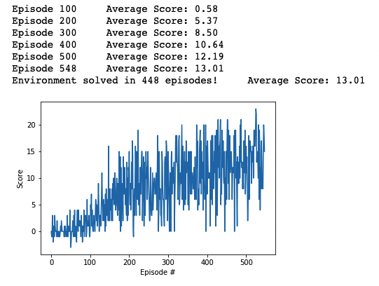

# Project report - Banana environment

[image1]: https://user-images.githubusercontent.com/10624937/42135619-d90f2f28-7d12-11e8-8823-82b970a54d7e.gif "The goal of the agent is to collect yellow bananas and avoid blue ones"

### Project Goal

The goal of this project was to build and train a deep reinforcement learning agent that navigates an environment similar to Unity's Banana collector environment.
The goal of the agent is to collect as many yellow bananas as possible

### Problem definition

- The agent has 4 possible moves: 0- move forward , 1- move backward, 2- move left, 3-move right
- The environment has size 37 
- The reward logic is: +1 for collecting a yellow banana, -1 for collecting a blue banana
- In order to solve the environment, the agent must achieve an average score of +13 over 100 consecutive episodes.
- The task is episodic

### Approach

#### Deep Q-Networks

This project implements a Value-based method called Deep Q-Networks.

Deep Q Learning combines two approaches:
- A Reinforcement Learning method called Q-Learning (aka Sarsa Max)
- A Deep Neural Network which works as a Function approximator and extends the Q-learning algorithm to the continuous space.

The specific algorithm used was described in the paper "Human-level control through deep reinforcement learning (2015)" and implements DQN with two major improvements:

- Experience Replay: the approach of keeping a buffer of past experiences which are sampled and then utilized again as source of information in order to get rid of correlation between consecutive experience tuples.
- Fixed Q targets: which decouples the states from the actions, fixing the function parameters used to generate the target with weights of a separate target network.

The algorithm is the following:

  

### Code implementation

The code was derived from the "lunar lander" excercise in the course, and has been adjusted and tuned to fit the new environment

The code consists in 3 files in the /p1_navigation folder: navigation.ipynb, model.py and dqn_agent.py

- navigation.ipynb contains the code to launch the environment and train the agent

- model.py contains the PyTorch implementation of the QNetwork. The network consists in two hidden fully connected layers of size 512 with ReLU activation, and Adam optimizer with learning rate 5e-4 and batch size 64. The size was tuned in order to be effective yet computationally fast enough for the gpu workspace it was trained on.
- dqn_agent.py contains the definition of the Agent class following the DQN algorithm. It provides several methods, including the Replay Buffer.

### Parameters

The hyperparameters used to train the agent were:

BUFFER_SIZE = int(1e5)  # replay buffer size
BATCH_SIZE = 64         # minibatch size (Initially 64)
GAMMA = 0.995           # discount factor (Initially 0.99)
TAU = 1e-3              # for soft update of target parameters
LR = 5e-4               # learning rate (Initially 5e-4)
UPDATE_EVERY = 4        # how often to update the network

and

dqn(n_episodes=2000, max_t=300, eps_start=0.10, eps_end=0.01, eps_decay=0.990)

Eps_start and eps_end refer to the Epsilon Greedy policy algorithm used to select the next action for the agent to perform. We let epsilon decay from 0.10 to 0.01 during the training in order to balance the exploration vs exploitation problem. This is a standard approach for the reinforcement learning policies, both in discrete and continuous environments.

### Results

This plot shows the average rewards at each episode, we see a nice reward profile, reaching +13 in 548 episodes

  

### Improvements

Despite reaching our goal in less than 1000 episodes, the DQN algorithm can be vastly improved by applying a combination of the following methods:

- Double DQN, wich deals with overstimation of the action values
- Prioritized Experience Replay, which consists in sampling non uniformally the experiences from the replay memory, and prioritize some transitions
- Dueling DQN, which is a different deep network architecture, consisting in splitting the final layer of the prior network in two, one for the state values V(s) and one for Advantage Values A(s, a), and finally combining them at the end

