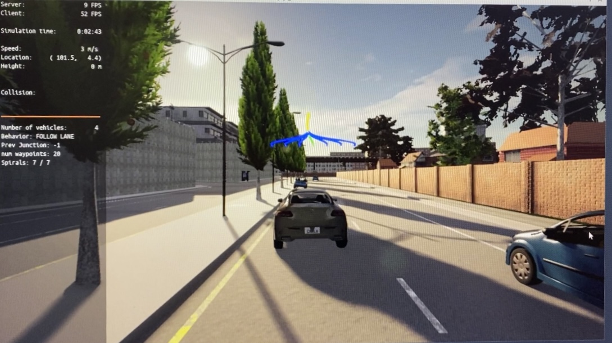
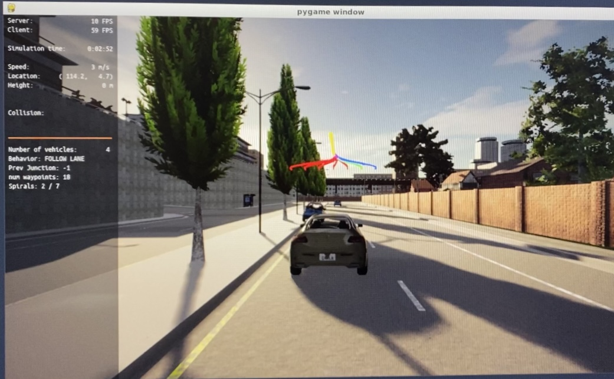
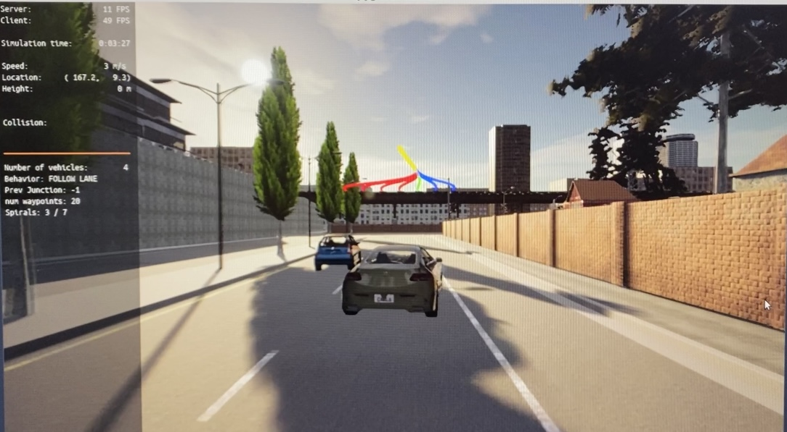

# Motion Planning and Decision Making for Autonomous Vehicles

This project is part of Udacity's Self-Driving Car Engineer Nanodegree<br/>
https://www.udacity.com/course/self-driving-car-engineer-nanodegree--nd013

## Description

In this project, we will implement two of the main components of a traditional hierarchical planner: The Behavior Planner and the Motion Planner. <br>
Both will work in unison to be able to:

>- Avoid static objects (cars, bicycles and trucks) parked on the side of the road (but still invading the lane). The vehicle must avoid crashing with these vehicles by executing either a “nudge” or a “lane change” maneuver.
>- Handle any type of intersection (3-way, 4-way intersections and roundabouts) by STOPPING in all of them (by default)
>- Track the centerline on the traveling lane.

## Usage

Carla simulator needs to be running in the background. 

Firsty unzip the following folders :

>- /project/utils.zip
>- /project/starter_files/eigen-3.3.7.zip
>- /project/starter_files/libcarla-install.zip
>- /project/starter_files/rpclib.zip


Then run the following commands:

```
su - student
// Will say permission denied, ignore and continue 
cd /opt/carla-simulator/
SDL_VIDEODRIVER=offscreen ./CarlaUE4.sh -opengl
```
And in a new prompt, compile and run the application using the following commands:

```
git clone https://github.com/pArtheum/MotionPlanning_-_DecisionMaking_AV.git
cd MotionPlanning_-_DecisionMaking_AV/project
./install-ubuntu.sh
cd starter_files/
cmake .
make
cd MotionPlanning_-_DecisionMaking_AV/project
./run_main.sh
// This might silently fail 
// ctrl + C to stop and restart
./run_main.sh again


// If error bind is already in use, or address already being used
ps -aux | grep carla
kill id
```

## Results

<p align="center">
  
</p>
The collision module is detecting an obstacle and steering accordingly
<p align="center">
  
  
</p>

### Improvements

I've noticed a non optimal behaviour when passing a car in the second lane. The ego car is steering when it should remain in the same line. Maybe a different boundary circles setting would fix this anomaly.
<p align="center">
  
</p>
