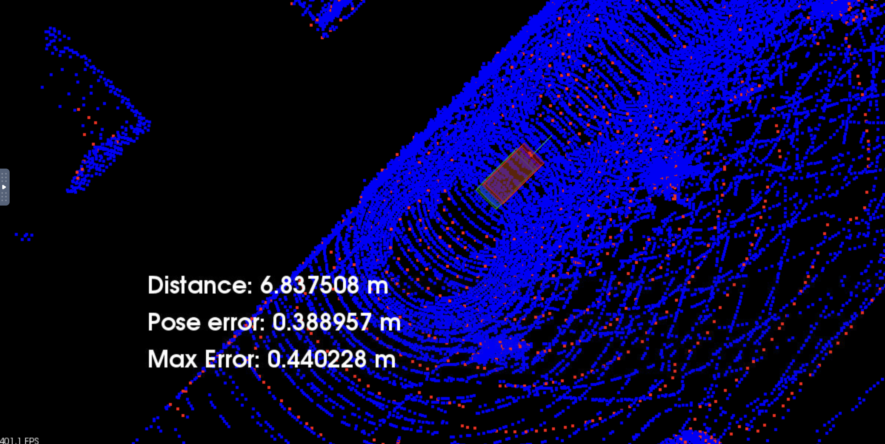

# Udacity-SDC-scan-matching-localization

Implementation of Scan matching localization with ICP and NDT algorithms, from the Udacity Self Driving Cars Nanodegree

The goal of scan matching is to find the relative pose (or transform) between the two robot positions where the scans were taken. The scans can be aligned based on the shapes of their overlapping features. For this purpose, we'll try two different and popular algorithms 




### Usage

To compile the code
```
cd /home/workspace/c3-project
cmake .
make
```

To run the project (this was designed for the Udacity workspace)

```
su - student // Ignore Permission Denied, if you see student@ you are good
cd /home/workspace/c3-project
./run_carla.sh
// Create new tab
cd /home/workspace/c3-project
```

To start the simulator and select the preferred algorithm by command line

- To run NDT
```
./cloud_loc NDT

//or

./cloud_loc
```

- To run ICP
```
./cloud_loc ICP
```
### Simulator controls

- to launch the simulation, press the `up arrow` key 3 times, with wait time of 1s

- to set the view to TOP DOWN, press the `a` key

- you can zoom in and move the view with the mouse and the common keyboard keys


### Results

#### ICP 

Parameters used

- transformation epsilon 1e-3
- iterations 60

Result


#### NDT

Parameters used

- transformation epsilon 1e-3
- iterations 100
- grid resolution 5


