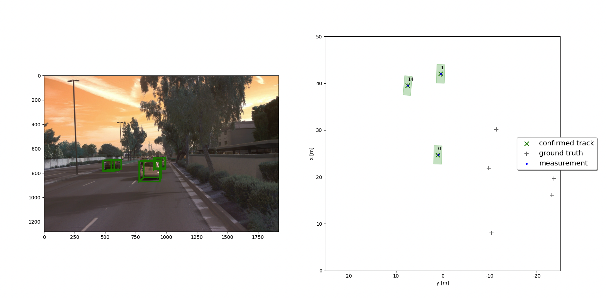
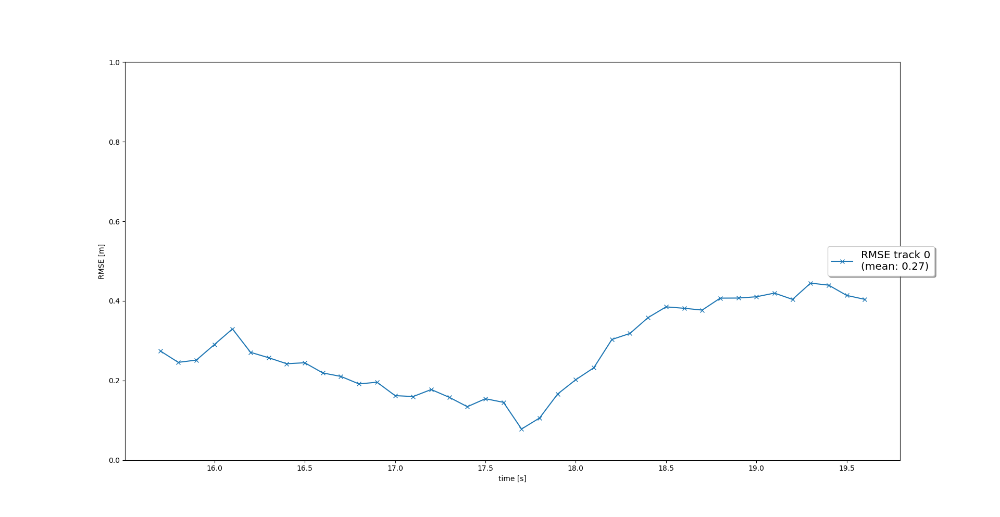
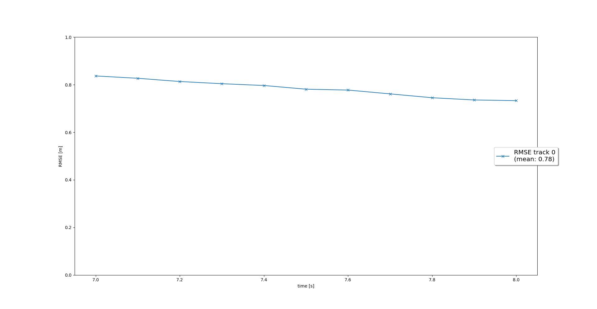
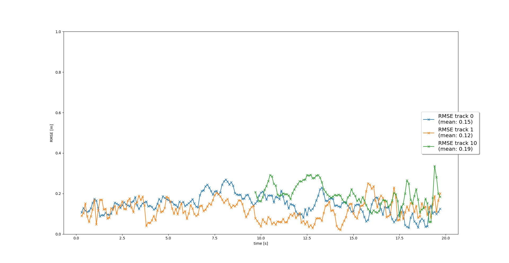
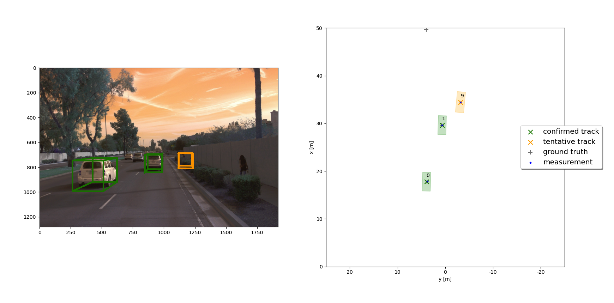
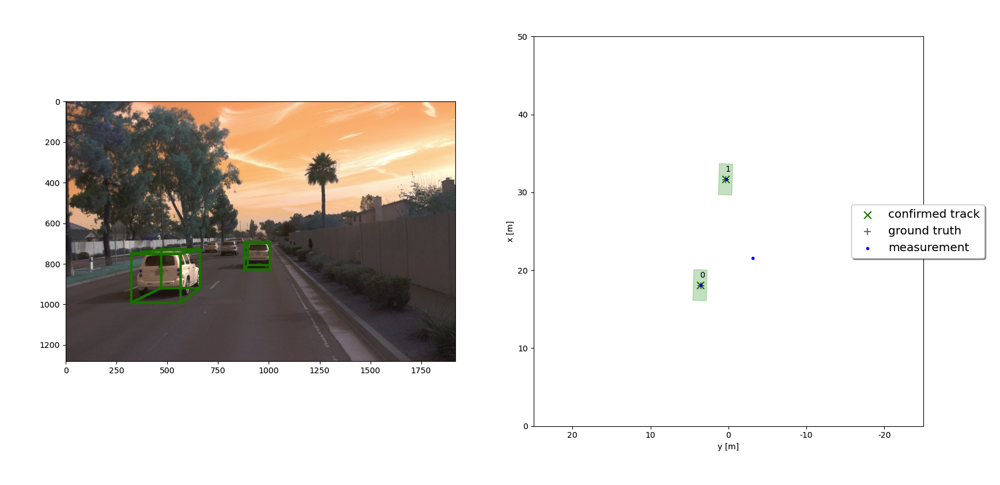

# Writeup: Track Objects over time - Final Project

This is the Final-Term Project for the second course in the [Udacity Self-Driving Car Engineer Nanodegree Program](https://www.udacity.com/course/c-plus-plus-nanodegree--nd213) : Sensor Fusion and Tracking.

The final project is built over the Mid-Term project code and consists of four main steps:




## Project Sections

Step 1: Implement EKF to track a single real-world target with lidar
'F_ID_S1'

Step 2: Implement the track management to initialize and delete tracks, set a track state and a track score
'F_ID_S2'

Step 3: Implement a single nearest neighbor data association to associate measurements to tracks (multitarget tracking)
'F_ID_S3'

Step 4: Implement the nonlinear camera measurement model
'F_ID_S4'


To run the project:

1. refer to the README.md file for all the requirements (libraries, dataset)


2. run the `loop_over_dataset.py` as follows: (pytonw for macbook terminal, otherwise python3)

```
python3 loop_over_dataset.py

or, on macbook terminal:
pythonw loop_over_dataset.py

```
In the loop_over_dataset.py you can select the F_ID sections separately by selecting them in line 103

All corresponding code for this project can be found in the `student` directory.
The project has been run locally on a 2021 M1 MacbookPro 

## Project recap and analysis

Let's walk through the project steps

### Step 1. Implement EKF to track a single real-world target with lidar

This task involves writing code within the file `student/filter.py` in order to implement an Extended Kalman Filter to track the objects detected from our lidar sensor.

The EKF algorithm involves the definition of the tracking problem in the state-space form as follows:

- 1. The problem is defined by a linear model, with the state vector x = (px, py, pz, vx, vy, vz). Thus, the System Matrix F will take dimension (6, 6). 

- 2. The vehicles are modeled with constant-velocity 

- 3. Process noise Q, raising from this simplified modeling of the vehicles dynamics, is supposed to be random with mean=0 and covariance matrix Q. The bigger the entries in q, the more acceleration and braking we expect in the motion scenario. Here, by default, `params.q = 3 m/s^2` which defines a normal highway motion scenrio.

- 4. Measurement noise is supposed to have mean 0 and covariance matrix R. The values of R depends on the sensor calibration and here are `params.sigma_lidar = 0.1` for Lidar sensor and `params.cam = 5` for Camera sensor.

- 5. The tracking results will be evaluated via RMSE error


In this step we'll define the `update()` and `predict()` functions in order to complete the Kalman filter.

We'll run the filter on a single track, and these are the RMSE results for the tracking (note that the plot has been saved after updating the standard x and P values with the calculated ones)

As you can see from the plot, the RMSE is <0.32 as expected.




### Step 2: Implement the track management to initialize and delete tracks, set a track state and a track score

This second task involves the completion of some functions inside the `student/trackmanagement.py` file.

The track management system allows the EKF to perform tracking of multiple objects simultaneously, handling the current tracks, the vanishing ones and the new tracks in an effective way.

To each tracked objects, a track ID, a tracking score and a tracking state will be assigned at each frame. Tracking states can get the values 'initialized', 'tentative' and 'confirmed'. 

After initializing a track, the track- measurement pairing process will determine its score and its state. Tracks with low scores, high uncertainty or no further measurements will be likely to be removed.

The track management system will also be able to deal with False Positive trackings (clutters or Ghost Tracks) and False Negative trackings (occlusions)

Below, the RMSE plot of a single track which has been deleted from the tracking list after some frames:



### Step 3: Implement a single nearest neighbor data association to associate measurements to tracks (multitarget tracking)

Data association is a key step of the EKF process, consisting in applying a specific algorithm in order to assign all each measurement to the track which is more likely to represent the object measured.

In this first commit, we'll use the SNN (Simple Nearest Neighbor) algorithm to perform the association. Note that this algorithm while being simple is more prone to reach partial optima. More sophisticated algorithms like GNN and JPDA will be tested in the Improvement section. 

The SNN applies the standard Mahalanobis distance to each track-measurement pair, thus populating the Association matrix A. Gating will also be performed in order to reduce the computational cost.

You'll find this step's code in the `student/association.py` file.

Below, the RMSE plot of this multi-track step, which correctly tracks 3 confirmed objects 




### Step 4: Implement the nonlinear camera measurement model

So far, we've been referring only on the Lidar sensor data for our tracking process. Thus, we'll now introduce the Camera data and see if there are some improvements over the same dataset.

The Camera Model is must take care of the non linearity of the measurements function, which raises from the need to project the 2D camera data to the 3D vehicle space. This process will introduce the linearization of the h(x) function via first order taylor espansion. This is the core of the Extended Kalman Filter approach.

In the current 3D case, where multivariate measurement gaussians take place, the Measurement Jacobian Hj(x) must be calculated.

The Camera FOV will be narrower than the Lidar one, but as we can see below, the RMSE results improved after introducing the camera data (as we expected)


Below, an example on how the camera data helped dealing with the ghost tracks:

Ghost tracks without camera data:




After introducing camera data, the faulty detection performed by lidar is not tracked:




## Writeup questions

#### Which part of the project was most difficult for you to complete, and why?
Following the exercises in class covered the majority of the steps in this final project. However, I spent most of the debugging time trying to define the association and camera model in the correct way.

#### Do you see any benefits in camera-lidar fusion compared to lidar-only tracking (in theory and in your concrete results)?
The beauty of the sensor fusion approach is it's capacity of getting the best from each sensor used. Camera and Lidar have their own advantages and disadvantages, but combination of different data sources will always improve the robustness and realibility of the system, performing a second check on false positives and false negatives, which in the Lidar realm can be caused by very light-absorbent or reflective objects.


#### Which challenges will a sensor fusion system face in real-life scenarios? Did you see any of these challenges in the project?
Using a state-space approach always implies creating a model of the real world scenario: the more precise the model the more accurate will be our output. In the project case, we modeled our vehicles as 'linear velocity' objects, expecting from them a modest variance in breaking/acceleration in the measurement covariance matrix. As simple as it may sound, the model will not be able to effectively predict the complex behaviour of the cars in a real urban environment (let's note that we also considered only vehicles detections, without tracking pedestrians, cyclists and so on). Considering a different model will sure increase the robustness of our tracking system.

#### Can you think of ways to improve your tracking results in the future?
There are many ways to improve our results, as also suggested in the project page:

- Parameters finetuning: e.g. we could apply the standard deviation values for lidar, which can be obtained from the 3D object detection in the midterm project, to parameters in the system noise Q
- Model choice: a more specific model (ex: bycicle non linear model) will be able to describe the dynamics of our vehicles in a more effective way.
- Data association algorithm: our results should improve applying a more sophisticated association algorithm, like GNN and JPDA
- Better object detection: improving the object detection performance will let our system be less prone to misclassification errors.
- Introducing object's width, length, heigth to the Kalman Filter
- Varying dt: varying dt could give more accurate predictions than the costant dt model.

