# Writeup: Track 3D-Objects Over Time - Midterm Project


This is the Mid-Term Project for the second course in the [Udacity Self-Driving Car Engineer Nanodegree Program](https://www.udacity.com/course/c-plus-plus-nanodegree--nd213) : Sensor Fusion and Tracking.

In this project, real-world data from [Waymo Open Dataset](https://console.cloud.google.com/storage/browser/waymo_open_dataset_v_1_2_0_individual_files) and 3D Point Cloud are used for LiDAR based Object Detection.


## Project Sections

The project is devided in 4 sections:

1. Compute Lidar Point-Cloud from Range Image 
-  'ID_S1_EX1': Visualize range image channels
-  'ID_S1_EX2': Visualize lidar point-cloud

2. Create Birds-Eye View from Lidar PCL 
- 'ID_S2_EX1': Convert sensor coordinates to BEV-map coordinates
- 'ID_S2_EX2': Compute intensity layer of the BEV map
- 'ID_S2_EX3': Compute height layer of the BEV map

3. Model-based Object Detection in BEV Image 
- 'ID_S3_EX1': Add a second model from a GitHub repo
- 'ID_S3_EX2': Extract 3D bounding boxes from model response

4. Performance Evaluation for Object Detection 
- 'ID_S4_EX1': Compute intersection-over-union between labels and detections
- 'ID_S4_EX2': Compute false-negatives and false-positives
- 'ID_S4_EX3': Compute precision and recall


To run the project:

1. refer to the README.md file for all the requirements (libraries, dataset)


2. run the `loop_over_dataset.py` as follows:

```
python3 loop_over_dataset.py
```
In the loop_over_dataset.py you can select the ID_EX sections separately by selecting them in line 87

All corresponding code for this project can be found in the `student` directory.
The project has been run locally on a 2021 M1 MacbookPro 


## Project recap and analysis

Let's go through the project sections with a closer look at:

- Finding and displaying 10 examples of vehicles with varying degrees of visibility in the point-cloud
- Identifying vehicle features that appear as a stable feature on most vehicles (e.g. rear-bumper, tail-lights) and describe them briefly. Also, use the range image viewer from the last example to underpin your findings using the lidar intensity channel.

### Section 1. Compute Lidar Point-Cloud from Range Image 

This section includes the following steps in order to visualize the range-intensity images and the 3Dpoint clouds:
-  'ID_S1_EX1': Visualize range image channels
-  'ID_S1_EX2': Visualize lidar point-cloud

We start retrieving the lidar data and range images of the roof-mounted lidar from the dataset and converting two channels (range and intensity) to 8bit scale and normalize the intensity channel between its 1-99 percentile in order to discard outliers. Then we stack the range and intensity channels vertically to visualize the range image.

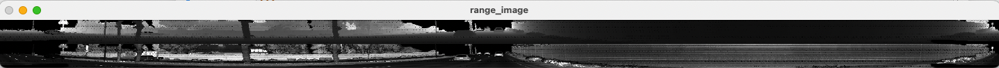

Then we visualize the Lidar point cloud using the open3d library
This will be the starter prespective

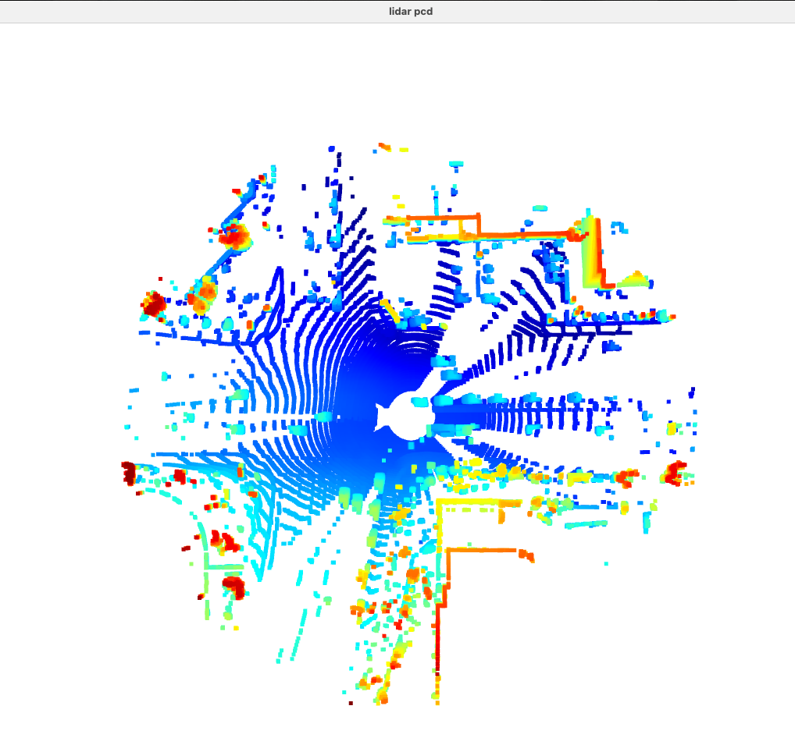


I've modified the loop_over_dataset.py and object_pcl.py in the ID_S1_EX1 part in order to display both the complete, the FRONT and the LEFT side range-intensity images.
By zooming the point cloud object we can find the corresponding point areas in order to compare the two visualizations as below:

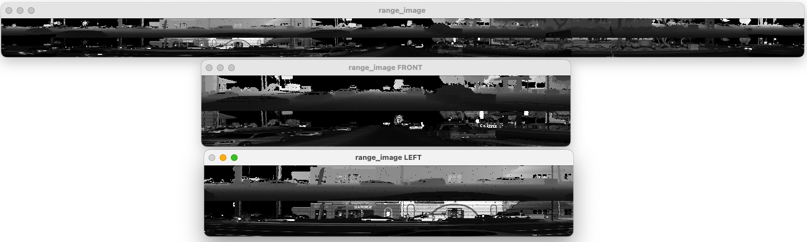
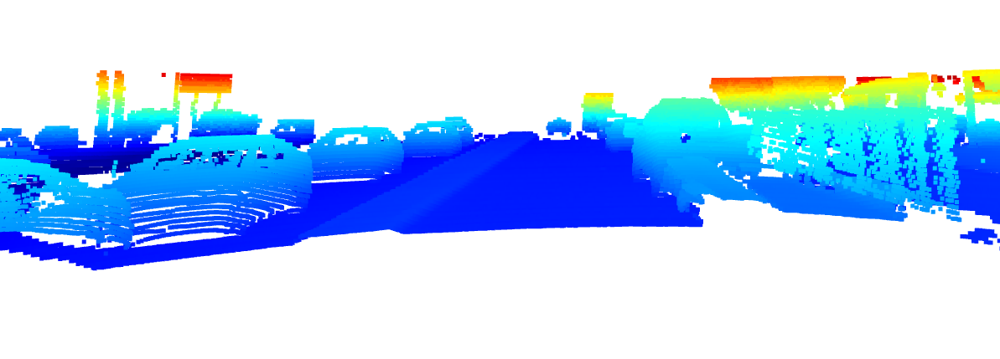
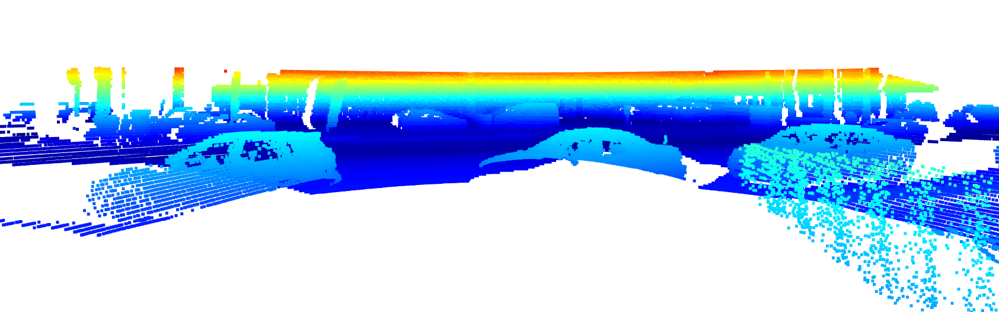


Looking at the range-intensity images, it's clear how the intensity channel is very sensitive about reflective vehicle parts such as licence plates, tail lights and front lights. It also discriminates well road line marks.

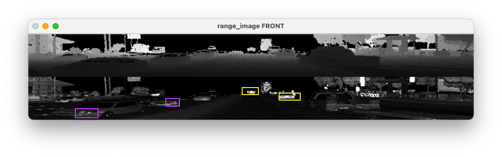

On the other side, 3D point clouds take account of the 3D shapes of the objects and their peculiar traits. In the below images we can assess how well windshields, wheels, side mirrors and the general vehicle shape is detected by the 3D point cloud 


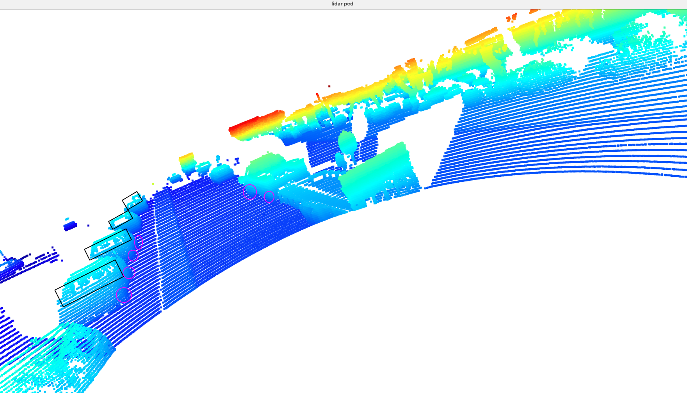

As seen during the course, an important trait of the point cloud regards how Multiple Signal Returns
are managed. For the sake of the course, the ri_return2 data from the waymo dataset are not used, but it would be very interesting to analyze how the point cloud empty areas will change using these data. 


### Section 2. Create Birds-Eye View from Lidar PCL 

This section includes the following steps in order to create and visualize the Bird-eye view (BEV) map:
- 'ID_S2_EX1': Convert sensor coordinates to BEV-map coordinates
- 'ID_S2_EX2': Compute intensity layer of the BEV map
- 'ID_S2_EX3': Compute height layer of the BEV map

In order to perform object detection, we consider projection-based approaches to reduce the dimensionality of the 3D point cloud along a specified dimension. One of the most used representations is the BEV map (bird's eye view map)(top-down view), a high information 2D projection of the 3D point cloud for behavior prediction and planning tasks. 

The BEV map pros are the following:
- The objects of interest are located on the same plane as the sensor-equipped vehicle with only little variance
- The BEV projection preserves the physical size and the proximity relations between objects, separating them more clearly than with both the FV and the RV projection.

which are achieved by compacting the point cloud along the upward-facing axis (the zz-axis in the Waymo vehicle coordinate system). The BEV is divided into a grid consisting of equally sized cells, which enables us to treat it as an image, where each pixel corresponds to a region on the road surface.  [Source: course notes]

Below: the BEV map from a frame in our dataset

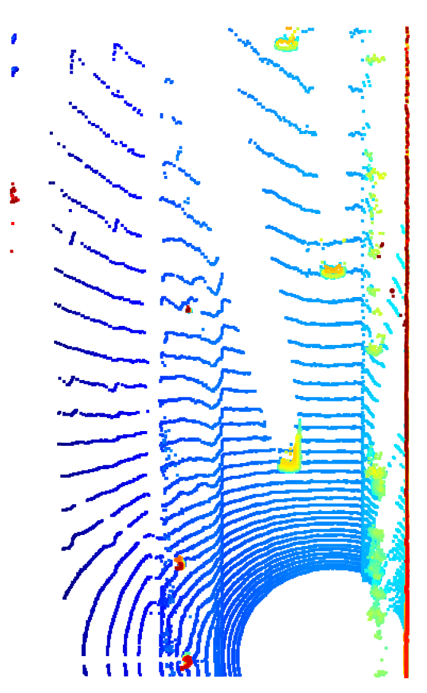

Next, we want to to fill the "intensity" channel of the BEV map with data from the point-cloud. In order to do so, we must identify all points with the same (x,y)-coordinates within the BEV map and then assign the intensity value of the top-most lidar point to the respective BEV pixel. Also, we must normalize the resulting intensity image using percentiles, in order to make sure that the influence of outlier values (very bright and very dark regions) is sufficiently mitigated and objects of interest (e.g. vehicles) are clearly separated from the background.

Below: the intensity layer of the bev map

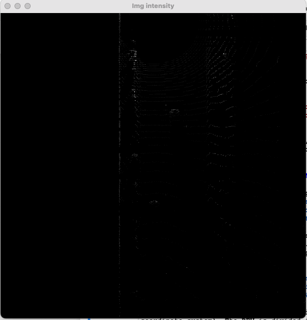

As we can see, it's not easy to visualize the point cloud here. We'll need to add the "height" channel of the BEV map with data from the point-cloud as below:

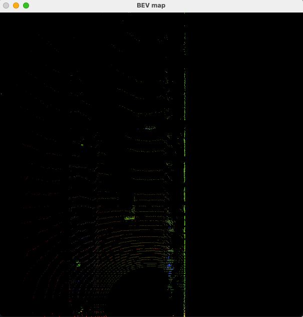

### Section 3. Model-based Object Detection in BEV Image

Now, within the BEV map we can draw the bboxes of the objects from the ground truth labels which are present in the dataset. 

Before the detections can move along in the processing pipeline, they need to be converted into metric coordinates in vehicle space. This task is about performing this conversion such that all detections have the format [1, x, y, z, h, w, l, yaw], where 1 denotes the class id for the object type vehicle.


Next, we can actually detect objects by loading the model from the Super Fast and Accurate 3D Object Detection based on 3D LiDAR Point Clouds (https://github.com/maudzung/SFA3D)

The network has the following architecture:

- ResNet-based Keypoint Feature Pyramid Network (KFPN) 

- Input: birds-eye-view (BEV) map as input. The BEV map is encoded by height, intensity, and density of 3D LiDAR point clouds. Assume that the size of the BEV input is (H, W, 3).

- Outputs: Heatmap for main center with a size of (H/S, W/S, C) where S=4 (the down-sample ratio), and C=3 (the number of classes) 

- Objects: Cars, Pedestrians, Cyclists, but we'll perform the detection for the Cars/Vehicles class

Below: the detection results on the SFA3D pretrained model

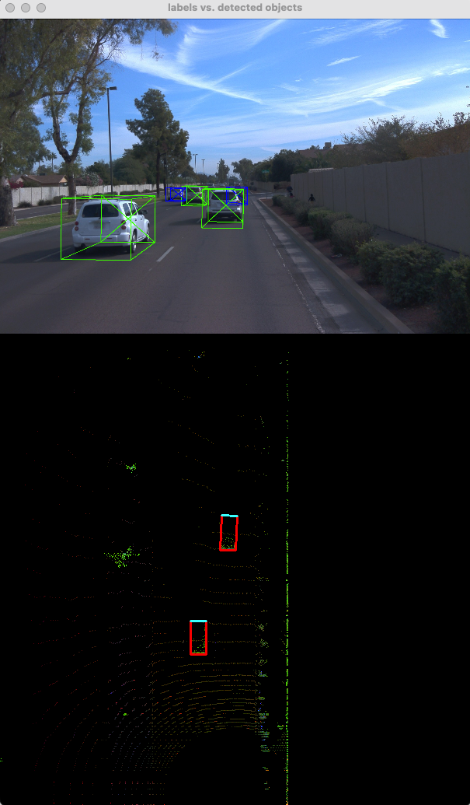

### Section 4. Performance Evaluation for Object Detection 

In this section we finally assess the performances of the vehicles detection on the dataset.

In order to do so, we perform the following steps:
- 'ID_S4_EX1': Compute intersection-over-union between labels and detections
- 'ID_S4_EX2': Compute false-negatives and false-positives
- 'ID_S4_EX3': Compute precision and recall

The charts below represent our results:

**Please note**  we weren't able to visualize the plots using the terminal because of some system limitations (macbook m1). In order to display it, we run `loop_over_dataset.py` setting `ex=ID_S4_EX3` at line 87. The script will create a `data.json` file , in which the python dictionary datastructure containing our metrics results has been written. Then, by running the script `display_charts.py` from a Python IDE we'll be able to visualize the plots as below.

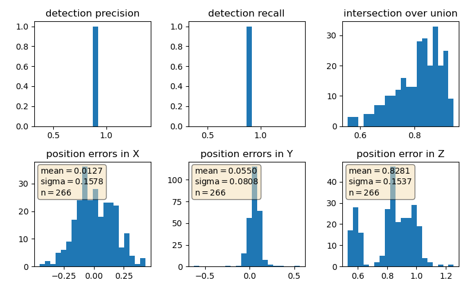
